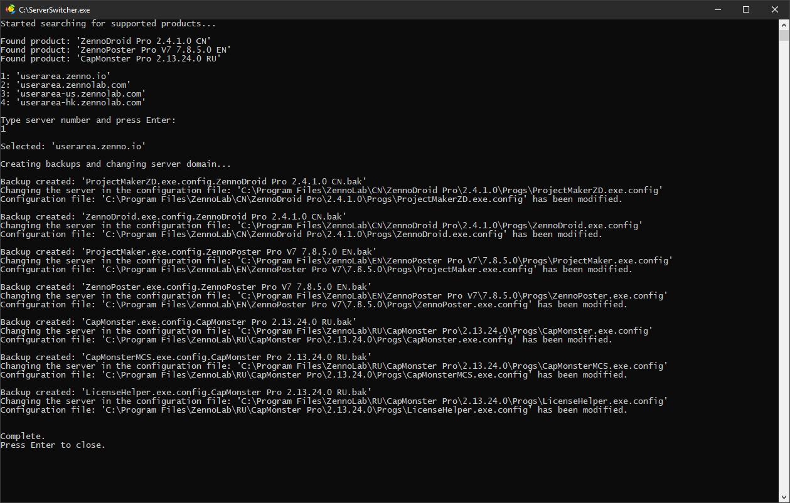

# ServerSwitcher

Run `ServerSwitcher.exe`.

Possible to specify the server number directly through the startup arguments:  
`ServerSwitcher 1`  
`ServerSwitcher 2`  
`ServerSwitcher 3`  
and via shortcuts or batch.

Don't forget to restart programs.
